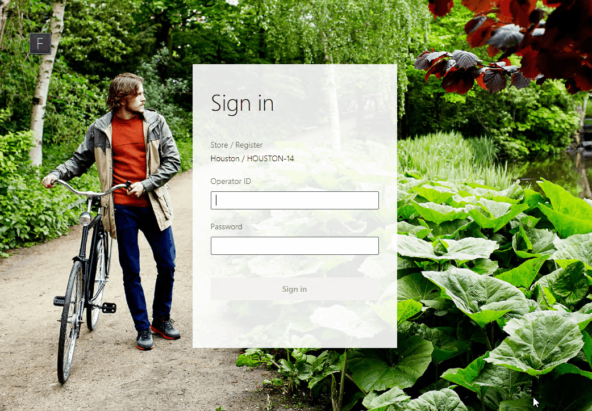

# Barcode MSR Dialog Sample
## Overview
This sample shows how to create a new dialog that listens to barcode scanner and magnetic stripe reader events. The sample dialog is used on the fulfillment line view in POS to scan a barcode to select the matching fulfillment line.

## Running the sample
- Open the solution in Visual Studio 2017
- Restore the nuget packages for the solution
- Build the solution
- Follow the steps outlined [here](https://docs.microsoft.com/en-us/dynamics365/commerce/dev-itpro/pos-extension/debug-pos-extension#run-and-debug-cloud-pos) on how to debug extensions
- Sign in to Cloud POS
- Navigate to the fulfillment line view and click the "Scan and Select Product" app bar button

## APIs and extension points used
### "PosApi/Create/Dialogs"
- ExtensionTemplatedDialogBase: The base class for all dialogs created by extensions.
  - openDialog: This protected method on the ExtensionTemplatedDialogBase class opens the dialog.
  - closeDialog: This protected method on the ExtensionTemplatedDialogBase class closes the dialog.
  - onReady: The onReady function is called after the extension dialog element has been added to the DOM and is ready to be used.
  - onBarcodeScanned: Setting the onBarcodeScanned event handler on the extension templated dialog in the constructor enables the dialog to handle barcode scanner events.
  - onMsrSwiped: Setting the onMsrSwiped event handler on the extension templated dialog in the constructor enables the dialog to handle MSR events.
### "PosApi/Consume/Controls"
- IControlFactory: The interface representing the POS control factory. The control factory instance is provided to extensions in the ExtensionContext.
  - Used by the BarcodeMsrDialog to create and display an alphanumeric numpad.
- IAlphanumericNumpad: The interface for the POS Number pad control that accepts alphanumeric input.
  - addEventListener: Used to add event listeners for the events listed below. Adding event listeners allows the extension to know when the number pad has updated or received input from the user.
    - "EnterPressed": Event raised when the number pad enter button was pressed.
    - "ValueChanged": Event raised when the number pad value has been updated.
### "PosApi/Consume/Dialogs"
- ShowMessageDialogClientRequest/ShowMessageDialogClientResponse: This API is used to show a message in POS and in this sample it is used to display an error message.
### "PosApi/Consume/ScanResults"
- GetScanResultClientRequest/GetScanResultClientResponse: This API is used to get the scan result information for the specified barcode scan text. A scan result can contain a product, customer, loyalty card or gift card entity.
### "PosApi/Extend/Views/FulfillmentLine"
- FulfillmentLineExtensionCommandBase: The base class for all extension commands for the fulfillment line view.
  - fulfillmentLinesSelectionHandler: Setting the fulfillmentLinesSelectionHandler event handler enables the extension command to update when a fulfillment line is selected.
  - fulfillmentLinesSelectionClearedHandler: Setting the fulfillmentLinesSelectionClearedHandler event handler enables the extension command to update when the fulfillment line selection is cleared.
  - packingSlipSelectedHandler: Setting the packingSlipSelectedHandler event handler enables the extension command to update when a packing slip is selected.
  - packingSlipSelectionClearedHandler: Setting the packingSlipSelectionClearedHandler event handler enables the extension command to update when the packing slip selection is cleared.

## Additional Resources
- [Debugging POS Extensions](https://docs.microsoft.com/en-us/dynamics365/commerce/dev-itpro/pos-extension/debug-pos-extension#run-and-debug-cloud-pos)
- [Using POS Controls](https://docs.microsoft.com/en-us/dynamics365/commerce/dev-itpro/pos-extension/controls-pos-extension)