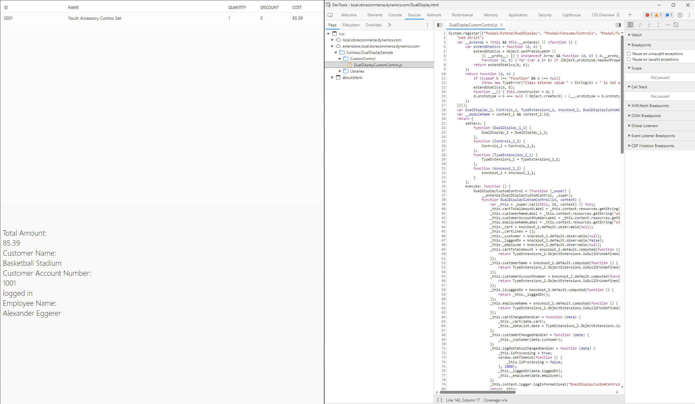

# Dual Display Sample
## Overview
This sample showcases a sample where the Store Commerce App is extended to show more information on dual display.

## Running the sample
- Open the Developer Command Prompt for Visual Studio 2022
- Restore the nuget packages for the solution by running "nuget restore DualDisplaySample.sln"
- Initialize Store Commerce development for the solution by running "msbuild DualDisplaySample.sln /t:InitDev"
- Open Visual Studio Code in the solution root directory
- Build the solution using the "Build & Install Store Commerce Extension" task in VSCode
- Open PowerShell as Admin in the ScaleUnit.Installer bin directory & run ".\Contoso.DualDisplaySample.ScaleUnit.Installer.exe install"
- Open the "Run & Debug Tab" in VSCode and use the "Debug Store Commerce" option to launch Store Commerce app with the debugger attached.
- Sign in to Store Commerce.
- Navigate to the transaction page and add a product to the cart.

> For dual screen mode to work, two physical displays must be connected to the device.

## Debugging the sample
To find your custom code in the debugger, you should use Developer tools (F12) in the second Store Commerce window. In the main window, the dual display extensions will not be visible.

## Additional Resources
- [Using POS Controls](https://docs.microsoft.com/en-us/dynamics365/commerce/dev-itpro/pos-extension/controls-pos-extension)
- [Use knockout.js in POS Extensions](https://docs.microsoft.com/en-us/dynamics365/commerce/dev-itpro/pos-extension/knockout-pos-extension)
- [Extend the point of sale (POS) Dual display view](https://learn.microsoft.com/en-us/dynamics365/commerce/dev-itpro/pos-dual-display-extension)