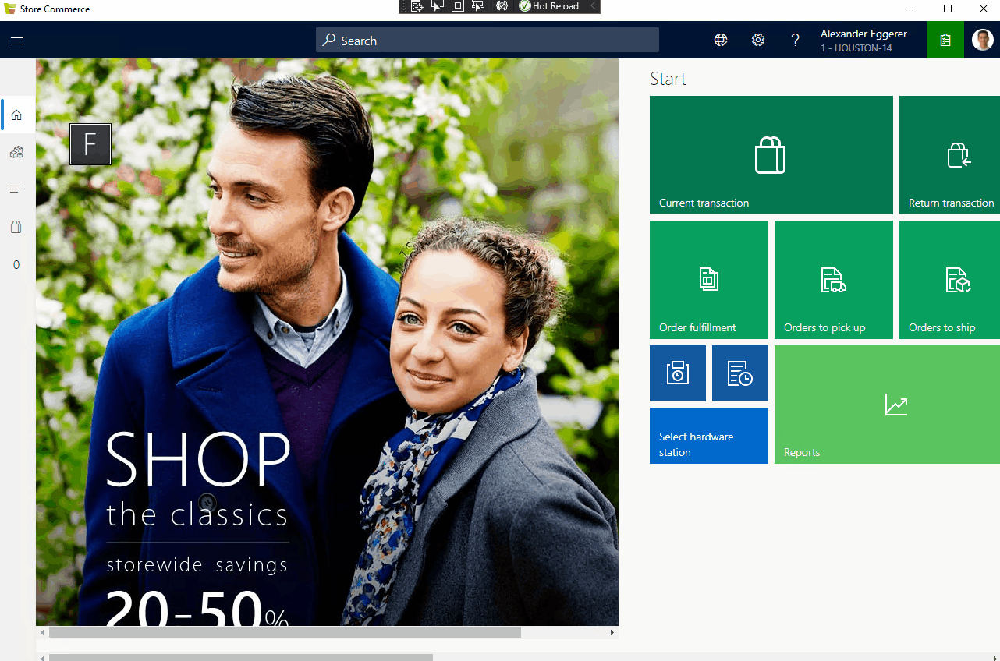

# Gas Station Pump Control Sample
## Overview
This sample showcases a sample where the Store Commerce App is extended to support common gas station scenarios. This sample extends the Store Commerce header to add a custom item that will provide users with information about the gas pump statuses on all views. The sample also adds a new view to display the complete status information for all gas pumps in the station. This view is reached by clicking the header extension and can be used to control the pumps and add gasoline to the cart. To simulate a customer pumping gas the sample adds an extension command to the SimpleProductDetailsView that is displayed when the details page is shown for a gasoline product.

## Configuring the sample
- [Create & configure a new product](https://docs.microsoft.com/en-us/dynamics365/commerce/create-new-product-commerce) with item id "gasoline" in HQ
  - Set the "Key in quantity" setting to "Must key in quantity" on the product under the "Commerce" tab
  - Set the unit of measure to gallons and configure base price on the product (See the "Configure a released product" section of the linked document.)
    - Edit the gallons unit of measure and set the decimal precision to 3
- [Assort the product](https://docs.microsoft.com/en-us/dynamics365/commerce/tasks/manage-assortments-2016-11) to your store
- Run the download jobs (1040, 1070 or 9999)

## Running the sample
- Open the solution in Visual Studio 2017
- Restore the nuget packages for the solution
- Build the solution
- Follow the steps outlined [here](https://docs.microsoft.com/en-us/dynamics365/commerce/dev-itpro/pos-extension/debug-pos-extension#run-and-debug-cloud-pos) on how to debug extensions
- Sign in to Cloud POS
- Navigate to the product details page for the gasoline product created in the previous section and click the pump gas command to launch the gas pump dialog.

## APIs and extension points used
### "PosApi/Create/Dialogs"
- ExtensionTemplatedDialogBase: The base class for all dialogs created by extensions.
  - openDialog: This protected method on the ExtensionTemplatedDialogBase class opens the dialog.
  - closeDialog: This protected method on the ExtensionTemplatedDialogBase class closes the dialog.
  - onReady: The onReady function is called after the extension dialog element has been added to the DOM and is ready to be used.

### "PosApi/Create/Views"
- CustomViewControllerBase:
  - super(context, config): The GasPumpStatusView calls the constructor for the base class with the context it is provided and its configuration object. See below for more information on the ICustomViewControllerConfiguration.
  - onReady: The POS framework calls the view's onReady method when the page has been added to the Document Object Model (DOM). This method is responsible for rendering the view inside the HTML element that is provided.
  - onShown: This method is called every time that the view is shown.
  - onHidden: This method is called every time that the view is hidden.
  - dispose: The POS framework calls the view's dispose method when the view is removed from the DOM and the POS navigation history. This method should release any resources that the view created.
- ICustomViewControllerConfiguration:
  - title: The title of the view. This will be displayed on the header.
  - commandBar: The command bar configuration containing the commands that should be displayed.
- ICommand: The ICommand interface the view controller to interact with app bar commands and update the command state.
  - canExecute: Setting the canExecute property to true enables the command on the UI and setting it to false disables the command.
  - isVisible: Setting the isVisible property controls whether or not the command is visible on the UI.
- Icons: The icons enum is used to set the icon that will be displayed for a command.

### "PosApi/Consume/Controls"
- IControlFactory: The interface representing the POS control factory. The control factory instance is provided to extensions in the ExtensionContext.
  - Used by the GasPumpStatusView to create and display a datalist showing the gas pumps.
- IDataList: The interface for the POS datalist control.
  - addEventListener: Used to add event listeners for the events listed below. Adding event listeners allows the extension to know when the datalist received input from the user.
    - "SelectionChanged": Event raised when a datalist row is selected or deselected.
### "PosApi/Consume/Dialogs"
- ShowListInputDialogClientRequest/ShowListInputDialogClientResponse: This API is used to show a list of options to the user and to get their selection. This sample uses the API to select a gas pump in the PumpGasExtensionCommand class.
- ShowMessageDialogClientRequest/ShowMessageDialogClientResponse: This API is used to show a message in POS and in this sample it is used to display an error message.

### "PosApi/Consume/Formatters"
- CurrencyFormatter: The currency formatter API is used to format currency values for display on the UI.
- DateFormatter: The date formatter API is used to format date values for display on the UI.

### "PosApi/Extend/Views/SimpleProductDetailsView"
- SimpleProductDetailsExtensionCommandBase: The base class for all extension commands for the simple product details view
  - productChangedHandler: Setting the "productChangedHandler" function enables the extension command to update when the product changes.

### "PosApi/Extend/Header"
- CustomPackingItem: The custom packing item class is the base class for all Store Commerce header bar extensions. In this sample, the GasPumpStatusPackingItem extends this class to add a button to the header to view the pump status.
  - position: CustomPackingItemPosition : The position field tells the Store Commerce extensibility framework where to place the custom header item. This can be before or after the out of the box Store Commerce packing items.
  - onReady(packedElement: HTMLElement, unpackedElement: HTMLElement): The Store Commerce framework calls the onReady method when the packing item elements have been added to the DOM. Each header packing item has two elements. The first is the "packedElement" this is the element that is displayed in the packing items overflow menu when it is expanded. This menu is used when there is not enough room in the header UI to show all of the packing items. The second element is the "unpackedElement" this is the element that is displayed in the Store Commerce header bar.
  - init(state: ICustomPackingItemState): The Store Commerce framework calls the init method to initialize the header packing item when the header is created.
  - dispose(): This method disposes all of the header packing item resources.

### "PosApi/TypeExtensions"
- ArrayExtensions: The array extensions class provides utility methods that make it easier to work with arrays.
- ObjectExtensions: The object extensions class provides utility methods that make it easier to work with javascript objects.

## Additional Resources
- [Debugging POS Extensions](https://docs.microsoft.com/en-us/dynamics365/commerce/dev-itpro/pos-extension/debug-pos-extension#run-and-debug-cloud-pos)
- [Create a custom view in POS](https://docs.microsoft.com/en-us/dynamics365/commerce/dev-itpro/pos-extension/custom-pos-view)
- [Using POS Controls](https://docs.microsoft.com/en-us/dynamics365/commerce/dev-itpro/pos-extension/controls-pos-extension)
- [Use knockout.js in POS Extensions](https://docs.microsoft.com/en-us/dynamics365/commerce/dev-itpro/pos-extension/knockout-pos-extension)
- [Consume custom headless Commerce APIs in POS](https://docs.microsoft.com/en-us/dynamics365/commerce/dev-itpro/pos-extension/consume-apis-pos)